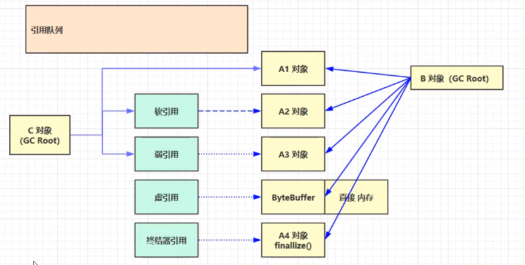
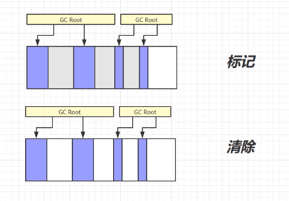
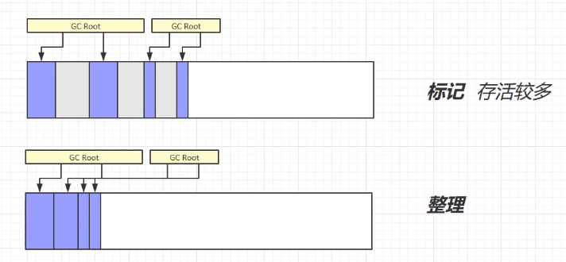
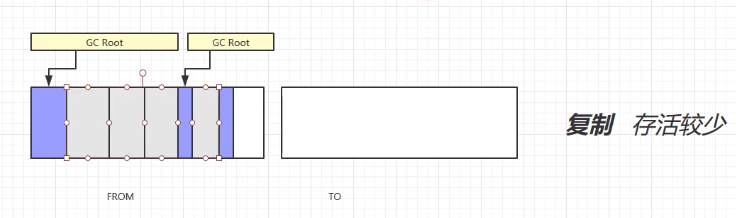
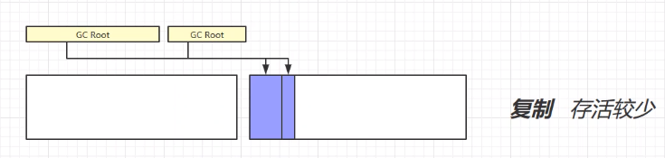
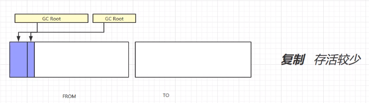

# 垃圾回收

## 1 判断对象是否可以回收

### 1.1 引用计数法

对于每个对象添加一个引用计数，当计数为0时，该对象则被回收。

* 弊：如果存在互相引用的情况，则会导致双方的内存均不会被回收

### 1.2 可达性分析法

以GC Root对象为起点，再 引用链上寻找该对象，如果找不到则表示该对象可以被回收。

可以作为GC Root的对象：

 	1. 虚拟机栈中引用的对象
 	2. 方法区中类静态属性引用的对象
 	3. 方法区中常量引用的而对象
 	4. 本地方法栈中JNI引用的对象

### 1.3 五种引用



 1. 强引用

    使用=赋值的对象，强引用对象不会被垃圾回收

 2. 软引用

    软引用的对象，在发生垃圾回收并且内存不足的情况下，该对象会被回收掉

    ````java
    //新建了软引用对象
    SoftReference<byte[]> ref = new SoftReference<>(new byte[_4MB]);
    //当垃圾对象回收时，会将软引用指向的对象的空间释放，但是软引用本身的空间并不会被释放
    //采用引用队列的方式用于关联并释放该空间
    ReferenceQueue<byte[]> queue = new ReferenceQueue<>();
    //绑定引用队列
    SoftReference<byte[]> ref = new SoftReference<>(new byte[_4MB], queue);
    ````

 3. 弱引用

    弱引用的对象，在发生垃圾回收时，无论内存是否充足都会被回收掉

    ```java
    //新建了弱引用对象
    WeakReference<byte[]> ref = new WeaktReference<>(new byte[_4MB]);
    //当垃圾对象回收时，会将软引用指向的对象的空间释放，但是软引用本身的空间并不会被释放
    //采用引用队列的方式用于关联并释放该空间
    ReferenceQueue<byte[]> queue = new ReferenceQueue<>();
    //绑定引用队列
    WeakReference<byte[]> ref = new WeakReference<>(new byte[_4MB], queue);
    ```

    

 4. 虚引用

    在虚引用对象进行垃圾回收时，该对象会被放入到引用队列，从而间接的调用垃圾回收算法，回收直接内存，主要配合ByteBuffer使用

 5. 终结器引用

    在终结器引用进行垃圾回收时，先将终结器引用放入到引用队列中，然后通过优先级很低的线程间接调用只想对象的finallize方法，在第二次GC时回收掉该内存

## 2 垃圾回收算法

### 2.1 标记清除



清除并不会清除内存数据，近似理解成在在系统空闲表中记录了刚刚被清除的内存空间的起始地址。

* 优：清除速度快
* 弊：会产生内存碎片

### 2.2 标记整理



清除时同时对内存进行紧凑，清除掉内存碎片。

* 优：解决了内存碎片问题
* 弊：效率较低

### 2.3 复制







* 优：避免了内存碎片
* 弊：需要双倍的内存

## 3 分代垃圾回收

## 4 垃圾回收器

## 5 垃圾回收调优


