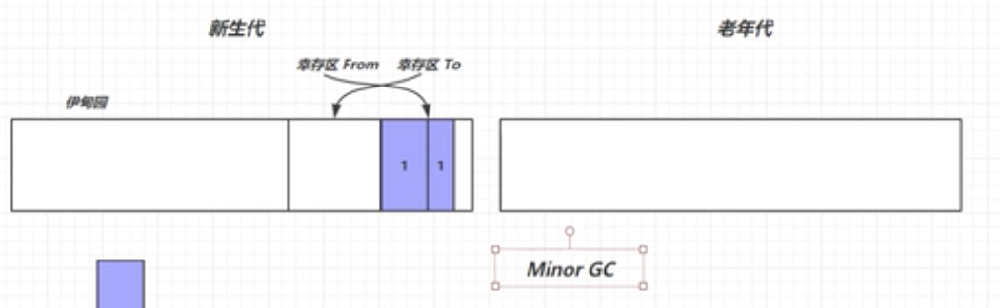
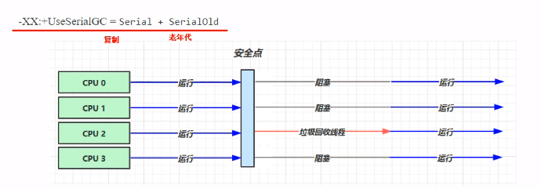
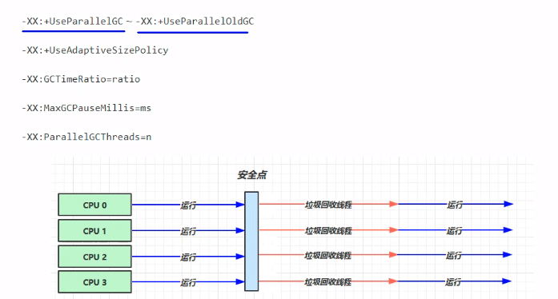
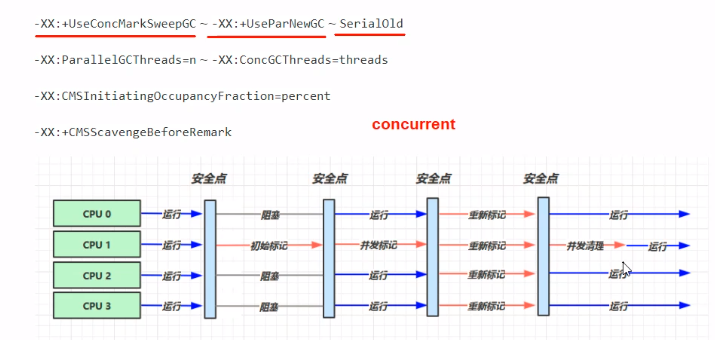
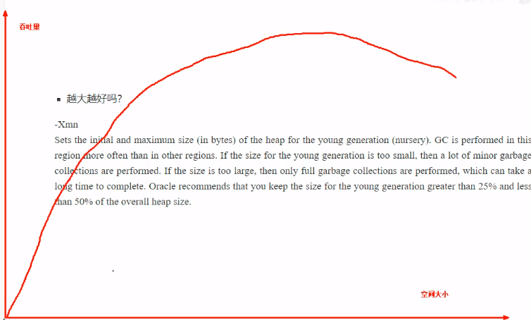

# 垃圾回收

## 1 判断对象是否可以回收

### 1.1 引用计数法

对于每个对象添加一个引用计数，当计数为0时，该对象则被回收。

* 弊：如果存在互相引用的情况，则会导致双方的内存均不会被回收

### 1.2 可达性分析法

以GC Root对象为起点，再 引用链上寻找该对象，如果找不到则表示该对象可以被回收。

可以作为GC Root的对象：

 	1. 虚拟机栈中引用的对象
 	2. 方法区中类静态属性引用的对象
 	3. 方法区中常量引用的而对象
 	4. 本地方法栈中JNI引用的对象

### 1.3 五种引用


 1. 强引用

    使用=赋值的对象，强引用对象不会被垃圾回收

 2. 软引用

    软引用的对象，在发生垃圾回收并且内存不足的情况下，该对象会被回收掉

    ````java
    //新建了软引用对象
    SoftReference<byte[]> ref = new SoftReference<>(new byte[_4MB]);
    //当垃圾对象回收时，会将软引用指向的对象的空间释放，但是软引用本身的空间并不会被释放
    //采用引用队列的方式用于关联并释放该空间
    ReferenceQueue<byte[]> queue = new ReferenceQueue<>();
    //绑定引用队列
    SoftReference<byte[]> ref = new SoftReference<>(new byte[_4MB], queue);
    ````

 3. 弱引用

    弱引用的对象，在发生垃圾回收时，无论内存是否充足都会被回收掉

    ```java
    //新建了弱引用对象
    WeakReference<byte[]> ref = new WeaktReference<>(new byte[_4MB]);
    //当垃圾对象回收时，会将软引用指向的对象的空间释放，但是软引用本身的空间并不会被释放
    //采用引用队列的方式用于关联并释放该空间
    ReferenceQueue<byte[]> queue = new ReferenceQueue<>();
    //绑定引用队列
    WeakReference<byte[]> ref = new WeakReference<>(new byte[_4MB], queue);
    ```

    

 4. 虚引用

    在虚引用对象进行垃圾回收时，该对象会被放入到引用队列，从而间接的调用垃圾回收算法，回收直接内存，主要配合ByteBuffer使用

 5. 终结器引用

    在终结器引用进行垃圾回收时，先将终结器引用放入到引用队列中，然后通过优先级很低的线程间接调用只想对象的finallize方法，在第二次GC时回收掉该内存

## 2 垃圾回收算法

### 2.1 标记清除


清除并不会清除内存数据，近似理解成在在系统空闲表中记录了刚刚被清除的内存空间的起始地址。

* 优：清除速度快
* 弊：会产生内存碎片

### 2.2 标记整理


清除时同时对内存进行紧凑，清除掉内存碎片。

* 优：解决了内存碎片问题
* 弊：效率较低

### 2.3 复制


* 优：避免了内存碎片
* 弊：需要双倍的内存

## 3 分代垃圾回收

### 3.1 垃圾回收机制

* 内存分配时，在eden区进行空间分配，直到eden区满或者不足以分配新任务所需空间。



* 触发Minor GC，将eden区以及survivor from区中存活的对象放入到survivor to区中，同时将每个对象的年龄加1，eden区对象默认年龄为0，最后交换from与to，to区起到一个复制整理的作用。
* 随着内存的不断分配回收，当suvivor区满时或者suvivor区中对象的内存超过阈值时，则会将suvivior区的对象转移到老年代。
* 当老年代空间满时，触发Full GC，同时也会触发Minor GC，同时清空新生代和老年代的无用对象，如果老年代空间仍然不够，则会抛出OutOfMemory异常。
* 大对象直接晋升老年代，如果对象大小大于新生代的最大容量，则对象则会直接晋升老年代。

无论是Minor GC还是Full GC，都会中断所有用户进程，防止发生错误。

### 3.2 相关JVM参数

* 堆初始大小：-Xms
* 堆最大大小：-Xmx  -XX:MaxHeapSize=size
* 新生代大小：-Xmn  -XX:NewSize=size
* 幸存区比例：-XX:SuvivorRatio=ratio
* 晋升阈值：-XX:MaxTenuringThreshold=threshold
* 晋升详情：-XX:+PrintTenuringDistribution
* GC详情：-XX:+PrintGCDetails-verbose:gc
* FullGC前MinorGC：-XX:+ScavengeBeforeFullGC

## 4 垃圾回收器

### 4.1 串行

* 单线程
* 堆内存较小，适合个人PC



#### 4.1.1 Serial

在到达安全点后阻塞所有用户进程，之后一个线程以复制的方式实现垃圾回收。

#### 4.1.2 Serial Old

在到达安全点后阻塞所有用户进程，之后一个线程以标记-整理的方式实现垃圾回收。

### 4.2 吞吐量优先

* 多线程
* 堆内存较大，多核CPU
* 尽可能使单位时间内STW最短



#### 4.2.1 Parallel Scavenge

到达安全点后，阻塞所有用户线程，所有的线程以复制的方式实现垃圾回收。

#### 4.2.2 Parallel Old

到达安全点后，阻塞所有用户线程，所有的线程以标记-整理的方式实现垃圾回收。

### 4.3 响应时间优先

* 多线程
* 堆内存较大，多核CPU
* 尽可能使单次STW最短\



#### 4.3.1 ParNew

到达安全点后，阻塞所有用户线程，将其余线程用于垃圾回收

#### 4.3.2 CMS

* 初始标记：阻塞所有线程，标记GC Root直连对象
* 并发标记：恢复用户线程，特定进程用于遍历初始标记得到的对象判断是否可以回收
* 重新标记：阻塞所有用户线程，将并发标记中发生变化的信息进行重新标记
* 并发清理：恢复用户线程，特定线程用于执行内存清理

### 4.4 G1

* 同时注重吞吐量和低延迟，默认暂停目标是200ms

* 超大堆内存，将堆划分为多个大小相等的region

* 整体上时表继整理算法，两个区域间是复制算法

* 相关JVM参数：

  -XX:+UseG1GC

  -XX:G1HeapRegionSize=size

  -XX:MaxGCPAuseMillis=time

## 5 **垃圾回收调优**

### 5.1 调优领域

* 内存
* 锁竞争
* CPU占用
* IO

### 5.2 调优目标

* 低延迟or高吞吐量，选择合适回收期
* CMS、G1、ZGC
* ParallelGC
* Zing

### 5.3 最快的GC是不发生GC

* 查看FullGC前后的内存占用，考虑
  - 数据是不是太多
  - 数据表示是否臃肿
    - 对象图
    - 对象大小
  - 是否存在内存泄漏

### 5.4 新生代调优

- 所有的new操作的内存分配非常廉价
  - TLAB：Thread-local Allocation Buffer 
- 死亡对象的回收代价为0
- 大部分对象用过即死
- Minor GC的时间远远低于Full GC



* 新生代能容纳所有并发量*（请求-响应）的数据
* 幸存区能保留当前活跃对象和需要晋升对象
* 晋升阈值配置得当，让长时间存活对象尽快晋升

### 5.5 老年代调优

* CMS的老年代内存越大越好
* 先尝试不调优，如果没有Full GC，则去进行新生代调优
* 观察Full GC时老年带占用，将老年代内存预设调大1/4~1/3